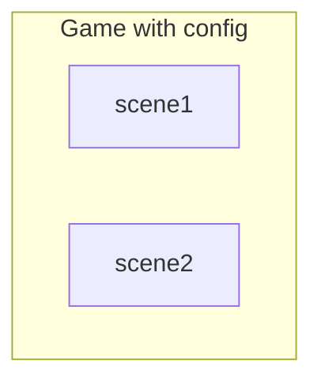
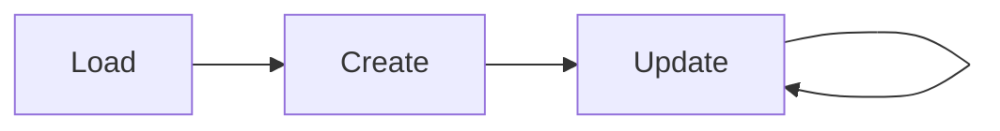

# A Ping Pong Game with Phaser 3

Javascript Web Programming 2020 fall --- Final Report


## Information
- Jan 17, 2021
- 0712238, National Chiao Tung University, Yan-Tong Lin
- 0312fs3@gmail.com
- online version: https://hackmd.io/JQeQTalNQXKTfdlEeMuTvQ
- source code on GitHub: https://github.com/EazyReal/Javascript-Web-Programming-2020-fall/tree/main/pong
- video demo: https://www.youtube.com/watch?v=hXmJieObNEw


---

## Overview
[TOC]

---

## Execution

Please make sure to **execute the code first** to get good intuition of the code of this project.

### Development Environment
- Operating System
    - cross platform (I do this on my PC as well as laptop)
    - Windows 10 Educational v1909, macOS Catalina v10.15.6
- Python Version
    - Python 3.8.3
- Browser
    - Chrome: Version 87.0.4280.88 (Official Build) (x86_64)

### Step by Step Guide to Execute the Webpage
1. download the zip file and unzip
2. open terminal and go to `/pong`
3. use any simple server to serve the current directory on localhost
    - e.g. if you have `python 3` installed, use `python3 -m http.server`
4. open the browser and go to `/pong` on the localhost
5. you should see the result (`index.html` with script running)

Note:
Because I am using Phaser 3, local assets should be hosted to be accessed.
Directly open `index.html` will not work since there will be cross-origin issues caused by loading local assets with Phaser 3 functionl.
If the step by step guide does not work, please just see the following video.

---

## A Video Demo

- https://www.youtube.com/watch?v=hXmJieObNEw

---

## Introduction to Phaser 3


### How to Include
- `script type="text/javascript" src="lib/phaser.min.js"></script>`

### Logistics



#### Game and its config
- Game class is a class that allows you to create a game unstance with certain config 
- In `game config` specify
    - `scene`s
    - `physics`
    - how to render
    - where is the parent


#### Scene 
- A scene can be view as the stage for acters (objects) in a drama (game) to interact.
- How the scene works and how objects in the scene interact is written in here.

### Stages


Note:
For more please reference the documents (given in reference in this slide).

---

## The Pong Game
I will go through important part of my codes and provide explanations. 
Must of the codes are quite straight-forward and speak for themselves. The concept of `physics group` can be found in the document of Phaser 3. (It declare a group that objects in that group follows a set of physical rules declared by user).

### Canvas for thr Game (`inde.html`)
- include Phaser 3
- include `game.js` as a module
- and some components (`p`s for displaying scores, rules, etc.) 
```html
<!doctype html>
<html lang="en">

<head>
    <meta charset="UTF-8" />
    <meta name="viewport" content="width=device-width, initial-scale=1">
    <meta name="description" content="ping pong">
    <title>Pong</title>
    <link rel="stylesheet" href="./css/main.css">
    <script type="text/javascript" src="./lib/phaser.min.js"></script>
    <script src="./js/game.js" type="module"></script>
</head>

<body>
    <h3 id="title">Ping Pong</h3>
    <div id="gameCanvas">
        <p id="scoreOne"></p>
        <p id="scoreTwo"></p>
    </div>
    <p style="text-align: center">Press Space to Start.</p>
    <p style="text-align: center">Key Up and Down to Move.</p>

</body>

</html>
```

### The Pong Game and its Config (`game.js`)
- we specify that we do not need gravity in this game
```javascript
import PongScene from "./scene.js";

export const screenWidth = 675;
export const screenHeight = 375;

const config = {
    type: Phaser.AUTO,
    parent: 'gameCanvas',
    width: screenWidth,
    height: screenHeight,
    transparent: true,
    resolution: 2,   
    physics: {
        default: "arcade",
        arcade: {
            gravity: { x: 0, y: 0 }
        }
    },
    scene: PongScene
};

const game = new Phaser.Game(config);
```

### Physics - World Bound, Ball Paddle Interaction (in `scene.js`)
- set world bound and it collidible

```javascript
this.physics.world.setBounds(0, 0, screenWidth, screenHeight, true, true, true, true);
```
- set physics groups for handling collision
```javascript
// create player group for player and ai
this.playerGroup = this.physics.add.group();
// add ball Group
this.ballGroup = this.physics.add.group({
    bounceX: 1,
    bounceY: 1,
    collideWorldBounds: true,
});
```
- declare collider to tell the program how to handle collide 
```javascript
//decide collide behavior
this.physics.add.collider(this.ball, this.playerGroup, this.hitPaddle, null, this);
```
```javascript
hitPaddle(ball, paddle) {
    let diff = 0;
    // above
    if (ball.y <= paddle.y) {
        // ball is on the left-hand side of the paddle
        diff = ball.y - paddle.y;
        ball.setVelocityY(400 * diff / screenHeight);
    }
    // below
    else if (ball.y > paddle.y) {
        // ball is on the right-hand side of the paddle
        diff = paddle.y + ball.y;
        ball.setVelocityY(400 * diff / screenHeight);
    }
    // accelerate the ball every bounce
    ball.setVelocityX(ball.body.velocity.x * 1.1);
}
```


### The Ball (in `scene.js`)
- create an instance of `ballGroup` (a physics group) and set its attributes
- `is_watting` is a data for ball instance to make AI know whether the game is on-going or not.
```javascript
// create the ball and describe its physics
this.ball = this.ballGroup.create(0, 0, "ball").setOrigin(0.5, 0.5);
this.resetBall(); // without this the ball starts in 0,0 and cause player 2 wins instantly
this.ball.setScale(0.5, 0.5);
this.ball.setMaxVelocity(screenWidth);
this.ball.setMass(1);
this.ball.body.onWorldBounds = true;
this.ball.type = 'ball';
this.ball.setData('is_waiting', true); // status of the ball
// particle emitter that follows ball
this.particles = this.add.particles('ball');
this.emitter = this.particles.createEmitter({
    speed: 50,
    scale: { start: 0.1, end: 0 },
    lifespan: 1000,
    blendMode: 'SCREEN'
});
this.emitter.startFollow(this.ball);
```

### An Emitter that Follows the Ball
```javascript
// particle emitter that follows ball
this.particles = this.add.particles('ball');
this.emitter = this.particles.createEmitter({
    speed: 50,
    scale: { start: 0.1, end: 0 },
    lifespan: 1000,
    blendMode: 'SCREEN'
});
this.emitter.startFollow(this.ball);
```


### Player Paddle Control (`player.js`)
- Just ordinary control with players' keyboards, nothing special.
- We have the make contructed instance part of physics group `playerGroup` in `scene`

```javascript
import { screenWidth, screenHeight } from './game.js';

export default class Player {
    constructor(scene, x, y, side="Left") {
        this.scene = scene;

        // Add sprite
        this.paddle = scene.playerGroup.create(x, y, "paddle").setScale(screenHeight / 1000).setOrigin(0.5, 0.5).setImmovable();
        this.paddle.setCollideWorldBounds(true);
        this.paddle.type = side;
    }

    update() {
        const scene = this.scene;
        const paddle = this.paddle;

        // keyboard controls
        if (scene.cursors.up.isDown) {
            paddle.setVelocityY(-screenHeight);
        } else if (scene.cursors.down.isDown) {
            paddle.setVelocityY(screenHeight);
        } else {
            paddle.setVelocityY(0);
        }
    }
}
```

### AI Paddle Control (`ai.js`)
The paddle of the AI will follow the ball once it's near the halfway point, and try to return to middle after that.

```javascript
import { screenWidth, screenHeight } from './game.js';

export default class AI {
    constructor(scene, x, y) {
        this.scene = scene;

        // Add sprite
        this.paddle = scene.playerGroup.create(x, y, "paddle").setScale(screenHeight / 1000).setOrigin(0.5, 0.5).setImmovable();
        this.paddle.setCollideWorldBounds(true);
        this.paddle.type = 'Right';
    }


    update(ball) {
        const paddle = this.paddle;
        // simple AI
        // the paddle will follow the ball once it's near the halfway point, and try to return to middle after that
        if (!ball.getData('is_waiting')) {
            // chase the ball
            if (ball.x > Phaser.Math.Between(screenWidth * 0.7, screenWidth * 0.9)) {
                if (ball.y > paddle.y) {
                    paddle.setVelocityY(screenHeight);
                } else if (ball.y < paddle.y) {
                    paddle.setVelocityY(-screenHeight);
                }
            }
            // maintain in middle position
            else {
                if (paddle.y < screenHeight * 0.5) {
                    paddle.setVelocityY(screenHeight*0.5);
                }else if (paddle.y > screenHeight * 0.5) {
                    paddle.setVelocityY(-screenHeight*0.5);
                }
            }
        }else{
            paddle.y = screenHeight * 0.5;
        }
    }
}
```


### Update logistics (`update` function in `scene.js`)
- the collisions are handle by the physics system we declared [here](#Physics---World-Bound-Ball-Paddle-Interaction) 
- so we judge whether winning condition is achieved and reset the game and update the scires

```js
update(time, delta) {
    this.player.update();
    this.ai.update(this.ball);

    // if ball goes out on left side (ai wins)
    if (this.ball.x < screenWidth * 0.01) {
        this.score2 += 1;
        console.log("player 2 wins")
        document.querySelector('#scoreTwo').innerHTML = this.score2;
        this.resetBall();
    }
    // ball goes out on right side (player wins)
    if (this.ball.x > screenWidth * 0.99) {
        this.score1 += 1;
        console.log("player 1 wins")
        document.querySelector('#scoreOne').innerHTML = this.score1;
        this.resetBall();
    }
}
```

---

## My words
- I considered a lot of different libraries before finalize on Phaser 3. The reason for choosing it is that it has a large community, is newer, and is free.
- The loading of the ending of this semester is quite heavy for me, so intead of making an easy RTS game of my own, I did a simple Ping Pong game instead.
- Game development is a very interesting thing to do (if one has free time), I will consider learn to make an RTS game on my own if I have spare time.

---

## References
- https://phaser.io/tutorials/getting-started-phaser3
- https://photonstorm.github.io/phaser3-docs/
- https://phaser.io/tutorials/making-your-first-phaser-3-game
- https://stackoverflow.com/questions/10752055/cross-origin-requests-are-only-supported-for-http-error-when-loading-a-local
- https://github.com/HuangJunye/qpong.js
- https://hackmd.io/uO6bDs7LRU-BXqOkt_9WBQ